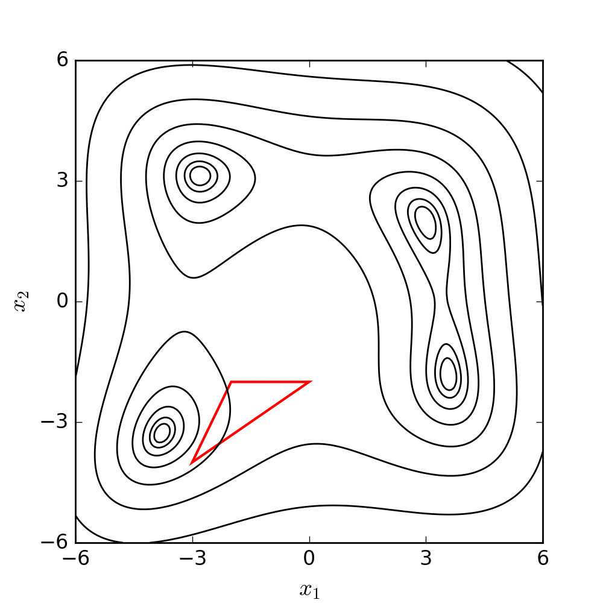
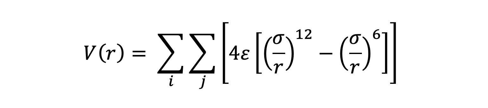
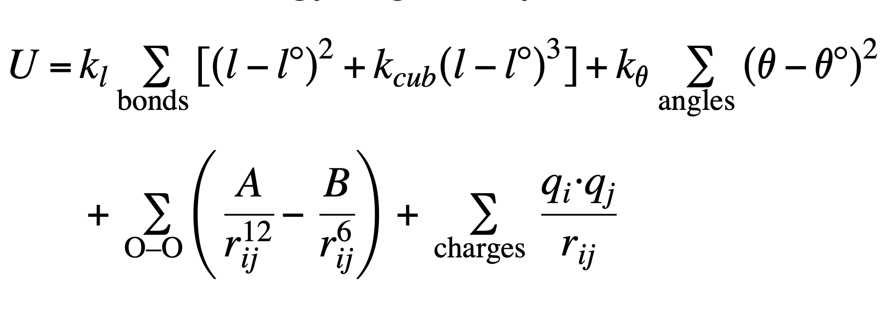

# Independent Study Research Problem III Final Report
- Sangjoon (Bob) Lee, ChE'23
- Ch393 Research Problem III I.S. 
- Spring 2023
- Prof. Robert Q. Topper

## Table of Contents
1. Overview
2. Introduction to Nelder-Mead Algorithm
3. Finding Minimum of Lennard-Jones Potential Clusters
4. Finding Minimum of Flexible Water Model with 2 Molecules
5. Rigid Body Optimization with TIP3P
6. Future Works
7. Acknowledgemnets

## 1. Overview
In the Spring 2023 IS semester, the primary goal of the project was to implement a gradient-free optimization algorithm. To accomplish this, a Python script was created to implement the algorithm, and additional Python scripts were developed to apply the Nelder-Mead simplex search algorithm for determining the optimal positions of atoms. The objective function to be minimized incorporated both the Leonard Jones potential and Ferguson's flexible water model.

The report is organized into three sections. The first section offers an overview of the Nelder-Mead algorithm, while the second and third sections delve into the application of the Nelder-Mead algorithm for finding the global minimum of Leonard Jones potential cluster systems for 2 to 5 atoms and the global minimum of water clusters with 2 molecules using Ferguson's flexible water model, respectively. The final section examines the process of performing rigid-body optimization for a system of two water molecules by doubling the bond and angle constants.

## 2. Introduction to Nelder-Mead Algorithm
The Nelder-Mead optimization algorithm, also known as the "simplex method," is a popular optimization method for multidimensional unconstrained problems. It is based on the geometric transformations of a simplex, which is a polytope with N+1 vertices in N-dimensional space. The algorithm uses four main operations to move the simplex: `reflection`, `expansion`, `contraction`, and `shrink`. These operations are used to explore the search space and find the minimum of a function.

The goal is to make the simplex smaller and explore the search space near the best vertex more closely. The Nelder-Mead algorithm iteratively applies these operations until a stopping criterion is met, such as a maximum number of iterations or a predefined tolerance level. The method is relatively easy to implement, and it can be effective for finding local minima in problems with few dimensions. The following diagram illustrates the search patterns for the minimum based on the set of moves described earlier.



> The gif was sourced from Wikipedia. ([source](https://upload.wikimedia.org/wikipedia/commons/d/de/Nelder-Mead_Himmelblau.gif))

### 2.1. In-Depth Explanation of Search Moves
Here, the four moves mentioned eariler are further described.

- **Reflection:** Involves reflecting the worst vertex of the simplex (the vertex with the highest function value) through the centroid of the remaining vertices. A new point is obtained by reflecting the worst vertex, which is hoped to have a lower function value. If the reflected point has a lower function value than the worst vertex, it replaces the worst vertex in the simplex.

- **Expansion:** Performed when the reflection produces a point with a lower function value than the best vertex. Involves moving the worst vertex even further in the direction of the reflected point. If the expanded point has a lower function value than the best vertex, it replaces the worst vertex in the simplex. If not, the method reverts to using the reflected point.

- **Contraction:** Occurs when the reflected point does not improve the simplex (i.e., it has a higher function value than the best vertex).
Involves moving the worst vertex towards the centroid, resulting in a contracted point. If the contracted point has a lower function value than the worst vertex, it replaces the worst vertex in the simplex.
If not, the method proceeds to the shrinking step.

- **Shrink:** A last resort when none of the previous operations improve the simplex.
Involves moving all vertices (except for the best vertex) towards the best vertex, effectively shrinking the simplex.

For a better understanding and visualization of each step, the set of moves has been further clarified and demonstrated using a 2D example below. The conditions and symbols used in the diagram were borrowed from the Wikipedia [page](https://en.wikipedia.org/wiki/Nelder%E2%80%93Mead_method).


### 2.2 Nelder-Mead Algorithm in Python
The `algorithm/nelder_mead.py` contains the `minimize` function. The function takes three inputs: the function to be minimized, the initial coordinates, the step size, and the maximum number of iterations. The following code snippet shows how the `minimize` function imported and used to find the minimum of the function with the coordinates provided.

```python
from nelder_mead import minimize
result = minimize(lj_potential, initial_coordinates, STEP_SIZE, MAX_ITR)
min_coordinates_reshape = result[0].reshape(-1, 3)
# [[ 1.03469093  0.74711977 -0.28923936]
#  [ 0.06002361  1.08824     0.15073982]
#  [ 0.51289411  0.11444437  0.47716191]]
# [[ atom1_x     atom1_y        atom1_z]
#  [ atom2_x     atom2_y        atom2_z]
#  [ atom3_x     atom3_y        atom3_z]]  

min_energy = result[1]
# -2.999999999999946
```
The output of the minimize function is a tuple containing the minimum coordinates and the minimum energy value. The minimum coordinates are reshaped into an array with dimensions (-1, 3), representing the x, y, and z coordinates of each atom.

The minimum energy value is then extracted from the result and stored in the `min_energy` variable. In this case, the minimum energy value is approximately -3.

## 3. Finding Minimum of Lennard-Jones Potential Clusters

### 3.1 Lennard-Jones Potential Overview
The Lennard-Jones (LJ) potential is a simple model that describes the interaction bewteen non-bonded atoms or molecules. It is widely used to model van der Waals forces and capture the balance between attractive and repulsive forces in molecular systems. The LJ potential has the following form



- `V(r)` is the potential energy between the particles as a function of the distance r between them.
- `ε (epsilon)` is the depth of the potential well, which represents the strength of the attractive force between the particles.
- `σ (sigma)` is the distance at which the potential energy between the particles is zero (the point where the attractive and repulsive forces balance each other out).
- `(σ/r)^12`, represents the repulsive force due to the overlap of the electron clouds (Pauli repulsion) when the particles are too close. `(σ/r)^6`, represents the attractive force arising from van der Waals interactions (induced dipole-induced dipole) at longer distances.

### 3.2. Number of Non-Bonded Interactions
One of the most important steps is determining the number of interactions between of non-bonded atoms. For instance, for 3 atoms, there are 3 interactions consisting of `1-2`, `1-3`, `2-3` where each number represents nth atom.

| N | Total # of interactions | Interactions                               |
|---|-------------------|--------------------------------------------------|
| 2 | 3                 | 1-2, 1-3, 2-3                                    |
| 3 | 4                 | 1-2, 1-3, 1-4, 2-3, 2-4, 3-4                     |
| 4 | 6                 | 1-2, 1-3, 1-4, 1-5, 2-3, 2-4, 2,5, 3-4, 3-5, 4-5 |

The `lj_potential` function, for example, successfully calcualtes the total number non-bonded interactions and determines the LJ potnetial energy given the set of coordinates.


```python
def lj_potential(params):
    # Reshape the flattened array into a 2D array of coordinates
    coordinates = params.reshape(-1, 3)  

    # Initialize the LJ potential energy to zero
    lj_sum = 0 
    
    # Determine non-bonded interactions and determine potential
    for i in range(N):
        for j in range(i+1, N):
            atom_i = coordinates[i]
            atom_j = coordinates[j]
            r = np.linalg.norm(atom_i - atom_j)
            lj = ((ALPHA / r)**12 - (ALPHA / r)**6)
            lj_sum += lj
    return 4 * EPSILON * lj_sum
```

### 3.3 Application of Nelder-Mead for LJ Clusters
`lj_clusters_opt.py` can be used to the global minimum of a Lennard-Jones (LJ) potential system for a given set of argon atoms using the Nelder-Mead optimization algorithm. The initial coordinates of the argon atoms are loaded from an input `.xyz` file provided by the user. The user can also choose to add perturbation to the initial positions of the atoms. 

The script calculates the LJ potential energy for the system, and then iterates over a specified number of optimization steps using the Nelder-Mead algorithm. For each iteration, the algorithm tries to minimize the LJ potential energy of the system, either from the initial coordinates or from perturbed initial coordinates, depending on the user's choice.

After each iteration, the code prints the minimum energy found and updates the minimum energy and corresponding coordinates if a lower energy is found. Finally, the optimized coordinates and the lowest energy found are saved to new files with the suffix `_opt.xyz` and `_opt.txt`, respectively.


#### 3.3.1 How to Run
First, install the following Python libraries, where `xyz-py` and `vg` are used to load .xyz files and calculate bond angles.

``` 
pip install xyz-py
pip install vg
```

Execute the script and enter the filename, then determine whether you want to add perturbation to the initial coordinates of the file.


```
(base) Computer:force-fied-optimizer boblee$ python lj_clusters_opt.py 
Q1/2. Enter the file name Ex) ./xyz/argon/argon_2.xyz: ./xyz/argon/argon_4.xyz        
Q2/2. Would you like to add perturbation to initial positions? (y/n) y
```

For each iteration, the program tries to minimize the LJ potential energy of the system.
```
---LJ Potential for 4 Argon Atoms---
Initial LJ potential -5.999999999691419 

Iteration 1: Min energy: -5.204031335923981
Iteration 2: Min energy: -5.999999999994923
Iteration 3: Min energy: -5.999996416805629
...
Iteration 28: Min energy: -5.999996980913861
Iteration 29: Min energy: -5.910751465045918
Iteration 30: Min energy: -5.999999999989604

Lowest energy found -5.99999999999929
[[-0.12625508  0.25881611  0.73693902]
 [ 0.73863315  0.92974473  0.4884553 ]
 [ 0.698946   -0.11206617  0.07255166]
 [ 0.88892803  0.04841085  1.16711785]] 
 ```

Now, there is a file called `argon_4_opt.txt` and `argon_4_opt.xyz` saved in the same folder where the original structure is stored.

### 3.3.2 Accuracy Test
Using the ε and σ value of 1, the script was able to determine the global minimum of LJ clsuters from 2 to 5 atoms with the values inthe following table. The unit of energy is the pair well depth.

| N | My code (rounded)  | Cambridge Energy Landscape Database by [J. Doye](http://doye.chem.ox.ac.uk/jon/structures/LJ/tables.150.html)|
|---|---------------|--------------|
| 2 | -1.000000     | -1.000000    |
| 3 | -3.000000     | -3.000000    |
| 4 | -6.000000     | -6.000000    |
| 5 | -9.103852     | -9.103852    |

## 4. Finding Minimum of Flexible Water Model for Dimer
The second application of the Nelder-Mead algorithm was determining the bond lenghts, bond angles, and inter-atomic distances based on the Furgerson flexible water model [1] for 2 water molecules.

### 4.1 Introduction to Flexible Water Model
The optimization is performed using the Nelder-Mead algorithm to minimize the Ferguson potential energy function, which is a custom potential function combining bond stretching, angle bending, Lennard-Jones, and Coulombic interactions with the following equation.



The parameters used in the above equation are tabualted as the following.

| Parameter | Value       | Description                             | Units                   |
|-----------|-------------|-----------------------------------------|-------------------------|
| K_L       | 547.5       | Spring constant for bond lengths        | kcal/(mol Å^-2)         |
| L         | 1.0         | Equilibrium bond length between O and H | Å                       |
| K_CUB     | -1.65       | Cubic force constant for bond lengths   | Å^-1                    |
| K_THETA   | 49.9        | Force constant for bond angles          | kcal/(mol rad^-1)       |
| THETA     | 109.5       | Equilibrium angle between O and H       | deg                     |
| A         | 650000      | Lennard-Jones potential constant        | kcal mol^-1 Å^12        |
| B         | 625.47      | Lennard-Jones potential constant        | kcal mol^-1 Å^6         |
| Q_H       | 0.413       | Partial charge on hydrogen atoms        | kcal^0.5 Å^0.5 mol^-0.5 |
| Q_O       | -0.826      | Partial charge on oxygen atoms          | kcal^0.5 Å^0.5 mol^-0.5 |
| K_VALUE   | 332.0637133 | Coulomb's constant                      | kcal/mol-Å-e^2 units    |

> The image the flexible water model equation and the values of the constants were acquired from [2]. 

### 4.2 Application of Nelder-Mead for Flexible Water Model
This `water_opt_ferguson.py` script performs a geometry optimization for water dimers using the Ferguson Flexible Water Model. It utilizes the Nelder-Mead optimization algorithm to find the lowest energy geometry based on the potential energy function implemented in the `Ferguson()` function in the script. The input is an XYZ file containing the initial geometry of the water dimer. The dimer initial geometry was acquired from the Cambridge Cluster Database ([source](https://www-wales.ch.cam.ac.uk/~wales/CCD/TIP4P-water.html)). The user can choose to add perturbation to the initial coordinates for each iteration. The output includes the optimized geometry saved in an XYZ file and the lowest energy found saved in a text file.

#### 4.2.1. How to Run

Execute the script and enter the filename, then determine whether you want to add perturbation to the initial coordinates of the file.

```
(base) Computer:force-fied-optimizer boblee$ python water_opt_ferguson.py 
Q1/2. Enter the file name Ex) ./xyz/water/tip4p_wales_n_2.xyz: ./xyz/water/tip4p_wales_n_2.xyz
Q2/2. Would you like to add perturbation to the initial coordinates for every iteration? (y/n) y
```


For each iteration, the program tries to minimize the flexible water potential energy of the dimer.

```
Iteration 1: energy converged: -6.872572130014703 kcal/mol
r1 (O1-H11): 0.99817117 Å
r2 (O1-H12): 1.01887432 Å
r3 (O2-H21): 1.00311607 Å
r4 (O2-H22): 1.0031181 Å
angle1: 107.63715525 °
angle2: 108.49307682 °
O-O: 2.74342933 Å
...
Iteration 10: energy converged: -6.872572138923323 kcal/mol
r1 (O1-H11): 0.99817179 Å
r2 (O1-H12): 1.01887163 Å
r3 (O2-H21): 1.00311599 Å
r4 (O2-H22): 1.00311617 Å
angle1: 107.63707928 °
angle2: 108.493184 °
O-O: 2.74343535 Å

The lowest energy found was -6.872572140447357 kcal/mol
[[-0.20494 -1.20670 0.82097]
 [-0.06910 -0.86743 1.74984]
 [-0.05054 -0.42806 0.18225]
 [0.23264 0.95768 -0.80703]
 [-0.51014 1.45724 -1.25978]
 [1.06885 1.07047 -1.34950]] 
```


Now, there is a file called `tip4p_wales_n_2_opt.xyz` and `tip4p_wales_n_2_opt.txt` saved in the same folder where the original structure is stored.


### 4.2.2 Accuracy Test
While the optimization has not perfectly converged the bond lengths and angles to the values reported in the literature, the differences are relatively small. One possible reason for these discrepancies could be the differences in the energy conversion factor used in the Coulomb interaction. It is reocmmended to determine what value was used for the charge of the electron in the original work. For example, an approximation such as 1.602 x 10^-19 C or even 1.6 x 10^-19 C might have been used, which would slightly affect the energy calculations.


|            | My code       | F.M. Torres et al. [2]|
|------------|---------------|-------------------|
| r1 (O1-H1) | 0.998 Å       | 0.999 Å           |
| r2 (O1-H2) | 1.020 Å       | 1.019 Å           |
| r3 (O2-H1) | 1.003 Å       | 1.006 Å           |
| r4 (O2-H2) | 1.003 Å       | 1.003 Å           |
| r5 (O1-O2) | 2.743 Å       | 2.748 Å           |
| angle1     | 107.6°        | 107.7 Å           |
| angle2     | 108.5°        | 108.4 Å           |

## 5 Rigid Body Optmization
The third application of the Nelder-Mead algorithm focuses on studying the behavior of water dimers as the force constants for vibrations and angles are progressively increased.

### 5.1 Introduction to Rigid Body Optimization
By performing a series of successive calculations with larger force constants, it is anticipated that the water molecules will become more rigid, ultimately approaching a rigid-body optimization. As this occurs, the equilibrium bond angles and bond lengths should converge towards the values specified in the force field. Furthermore, the internal energy required to distort the molecules is expected to decrease, causing the optimized total energy to approach the rigid-body interaction energy.

### 5.2 Application of Nelder-Mead in Rigid Body Optimization
To test this hypothesis, the investigation begins with the Ferguson Flexible Water Model and gradually increases the vibration and angle force constants, doubling them at each step. The parameters of the TIP3P force field within the Ferguson Flexible Water Model framework are used. This approach enables a comparison of the resulting energies with the TIP3P literature values. The investigation offers valuable insights into the behavior of water dimers as they become more rigid and helps to determine if the optimized total energy converges towards the rigid-body interaction energy as specified by the TIP3P model.

#### 5.2.1 How to Run
The `water_rigid_opt_tip3p.py` script performs a series of optimizations on a system of two water molecules. The main loop iterates over a specified number of iterations, and in each iteration, the bond stretching force constant (`K_L`) and the angle bending force constant (`K_THETA`) are doubled. At every step, the geometrical coordinates found in the preceding iteration become the origin of the next optimization. Additionally, the program prints out the properties of the optimized system, including the bond lengths, bond angles, and O-O distance.

The code starts by asking the user to enter the file name containing the water molecule system's initial coordinates. The file should be in the .xyz format and located in the specified directory.

```
Q1. Enter the file name Ex) ./xyz/water/tip4p_wales_n_2.xyz: ./xyz/water/tip4p_wales_n_2.xyz
```


The output below represents the first iteration of the optimization process, which uses the initial force constants for bond stretching (`K_L`) and angle bending (`K_THETA`). The code outputs he optimized energy in both kcal/mol and kJ/mol units, as well as the bond lengths, bond angles, and O-O distance.

```
Iteration 1: K_L=547.5 and K_THETA=49.9: energy converged: -6.785457144383967, kcal/mol / -28.39035269210252, kJ/mol
r1 (O1-H11): 0.9554775 Å
r2 (O1-H12): 0.97497967 Å
r3 (O2-H21): 0.96038255 Å
r4 (O2-H22): 0.96038154 Å
angle1: 102.37079467°
angle2: 103.53699447°
O-O: 2.73096161 Å
```

The output provided below represents the last iteration in the optimization process, where the force constants have been doubled multiple times. The optimized energy, bond lengths, bond angles, and O-O distance are displayed once more. A message indicating that the energy has converged appears when the difference in energy between iterations is smaller than the `CONVERGENCE_CRITERIA`, which is set to 0.00005.

```
...
Iteration 16: K_L=17940480.0 and K_THETA=1635123.2: energy converged: -6.5400581161444045, kcal/mol / -27.36360315794819, kJ/mol
r1 (O1-H11): 0.95719995 Å
r2 (O1-H12): 0.95720049 Å
r3 (O2-H21): 0.95720009 Å
r4 (O2-H22): 0.95720009 Å
angle1: 104.51993829°
angle2: 104.51997157°
O-O: 2.74695015 Å
*Energy has converged
New xyz file written to ./xyz/water/tip4p_wales_n_2_tip3p_rigid_opt.xyz
```

#### 5.2.2 Accuracy Test

|                  | My code  | TIP3P (1998 Wales and Hodges) |
|------------------|----------|-------------------------------|
| Bond length (Å)  | 0.9572   | 0.9572                        |
| Bond angle (deg) | 104.52   | 104.52                        |
| Energy (kJ/mol)  | -27.3636 | -27.3631                      |

The precision of the code is quite high as can be perceived from the table above. It is important to point out that there is just a small variation in the energy levels, whilst the bond lengths and bond angles are exactly the same. This conclusion implies that the rigid body optimization has worked properly but there could be an issue with the conversion factor.

The slight difference in energy values between the code and the TIP3P literature values might be attributed to differences in the energy conversion factor used for the Coulomb interaction. It is worth investigating this aspect further as the next step. For instance, the contemporary definition of the charge of the electron is precisely 1.602176634×10−19 C. However, a marginally different value, such as 1.602 x 10^-19 C or 1.6 x 10^-19 C, could have been utilized, which would have an impact on the energy calculations. These issues would not arise if all calculations were conducted in atomic units.

## 6. Conclusion and Future Works
In conclusion, the Nelder-Mead optimization algorithm was successfully implemented and applied to a range of problems, including the determination of the global minimum of Lennard-Jones potential cluster systems for 2 to 5 atoms, finding the global minimum of water clusters with 2 molecules using Ferguson's flexible water model, and performing rigid-body optimization for a system of two water molecules by doubling the bond and angle constants. The results obtained from these applications were closely consistent with the literature values, showcasing the effectiveness and versatility of the Nelder-Mead optimization algorithm in solving various types of optimization problems. Overall, the Nelder-Mead optimization algorithm proved to be a valuable tool for solving a range of problems in computational chemistry and molecular modeling, and its ease of implementation and adaptability make it a popular choice for tackling various optimization tasks.

While the Nelder-Mead optimization and force field implementation were performed correctly, the unit conversion of the charge described in several accuracy test section requires further investigation. In addition, the current code is restricted to water molecules only, and an automated generation of harmonic force fields for any molecule could be a valuable enhancement. Furthermore, integrating another gradient-free optimization algorithm into the existing code could be advantageous in comparing both speed and accuracy.

## 7. Acknolwedgemnts
I would like to express my gratitude to Professor Robert Topper for teaching and mentorship during the three semesters of Independent Study at The Cooper Union. I would like to thank the authors and software developers for providing the tools which allowed this project to be completed within the time frame.

## References
[1] Ferguson, D. M. Parameterization and evaluation of a flexible water model. *Journal of Computational Chemistry* **16**, 501–511 (1995). 

[2] Torres, F. M., Agichtein, E., Grinberg, L., Yu, G. &amp; Topper, R. Q. A note on the application of the “boltzmann simplex”-simulated annealing algorithm to global optimizations of argon and water clusters. *Journal of Molecular Structure: THEOCHEM* **419**, 85–95 (1997). 

[3] Wales, D. J. &amp; Hodges, M. P. Global minima of water clusters (h2o)n, N≤21, described by an empirical potential. *Chemical Physics Letters* **286**, 65–72 (1998). 

[4] Topper, R. Q., Topper, S. L. &amp; Lee, S. TransRot: A portable software package for simulated annealing Monte Carlo geometry optimization of atomic and molecular clusters. *ACS Symposium Series* 19–38 (2022). doi:10.1021/bk-2022-1428.ch002 